# LAW-GPT System Architecture And Operations

## 1. Executive Summary

LAW-GPT is not a single-model chatbot. It is a routed legal AI system for Indian law built from these layers:

- FastAPI API gateway
- query guardrails and routing
- clarification engine for personal-case consultations
- agentic RAG engine for planning, retrieval, synthesis, and verification
- parametric retrieval layer for vector and hybrid search
- vectorless statute retrieval layer through PageIndex
- session memory and semantic cache
- Azure App Service deployment with hot-patch startup logic

The current production shape favors correctness and recovery over raw concurrency. It is designed to answer simple legal questions directly, ask clarification questions for case-specific problems, and degrade gracefully when an upstream model or retrieval path has issues.

## 2. Current Live System Status

Latest verified live benchmark state against the hosted backend:

- Core chatbot benchmark: 13/13 pass, 100 percent
- Routing and 5-question clarification benchmark: 16/16 pass, 100 percent
- Context retention benchmark: 19/20 chains pass, 95 percent
- Ground-truth legal QA benchmark: composite 85.68 percent, section citation accuracy 90.33 percent, factual accuracy 81.33 percent

Source reports:

- [tests/results/t12_core_behaviors_20260307_163143.json](tests/results/t12_core_behaviors_20260307_163143.json)
- [tests/results/t11_routing_clarification_20260307_162945.json](tests/results/t11_routing_clarification_20260307_162945.json)
- [tests/results/t6_context_20260307_163525.json](tests/results/t6_context_20260307_163525.json)
- [tests/results/accuracy_report_20260303_094228.json](tests/results/accuracy_report_20260303_094228.json)

## 3. Top-Level Components

### API Layer

Main API entry point:

- [kaanoon_test/advanced_rag_api_server.py](kaanoon_test/advanced_rag_api_server.py)

Responsibilities:

- health and status endpoints
- startup and background initialization
- request validation and session management
- safety refusal
- out-of-scope foreign-law rejection
- invalid section reference rejection
- clarification loop orchestration
- fallback handling on rate limits or partial failures

### Unified Orchestrator

Main orchestrator:

- [kaanoon_test/system_adapters/unified_advanced_rag.py](kaanoon_test/system_adapters/unified_advanced_rag.py)

Responsibilities:

- initialize retrieval stores
- initialize main LLM client manager
- initialize agentic engine
- initialize memory manager
- initialize PageIndex retriever
- route simple and complex paths into the agentic system

### Agentic RAG Engine

Main reasoning loop:

- [kaanoon_test/system_adapters/agentic_rag_engine.py](kaanoon_test/system_adapters/agentic_rag_engine.py)

Core stages:

- memory and cache lookup
- conversation-context injection
- simple direct mode for factual queries
- planning
- retrieval
- synthesis
- verification or reflection
- plan refinement when confidence is low
- memory and cache update after answer generation

### Clarification Engine

Case-consultation state machine:

- [kaanoon_test/system_adapters/clarification_engine.py](kaanoon_test/system_adapters/clarification_engine.py)

Responsibilities:

- detect whether the user is asking a knowledge question or describing a personal legal problem
- ask up to five clarification questions
- maintain question-answer history
- synthesize a final consultation matrix for downstream RAG

### Parametric Retrieval Layer

Main parameter-driven retriever:

- [kaanoon_test/system_adapters/parametric_rag_system.py](kaanoon_test/system_adapters/parametric_rag_system.py)

Responsibilities:

- accept routing parameters such as domain, keywords, sections, case names, and complexity
- build an enhanced query
- choose direct hybrid retrieval for simple and medium queries
- use advanced retrieval with multi-query and HyDE only for complex queries
- rerank results
- build retrieval context for the generator

### Vectorless Statute Retrieval Layer

PageIndex retriever:

- [kaanoon_test/system_adapters/pageindex_retriever.py](kaanoon_test/system_adapters/pageindex_retriever.py)

Responsibilities:

- upload statutes once to a tree index in PageIndex cloud
- use LLM-guided tree traversal rather than vector similarity
- fetch exact text from relevant statute nodes
- fall back cleanly to normal retrieval if PageIndex is unavailable

### Memory Layer

Memory manager:

- [kaanoon_test/system_adapters/persistent_memory.py](kaanoon_test/system_adapters/persistent_memory.py)

Responsibilities:

- short-term conversation memory
- persisted session memory across requests
- long-term user profile memory
- semantic answer cache

### LLM Client Rotation Layer

Provider and key manager:

- [kaanoon_test/utils/client_manager.py](kaanoon_test/utils/client_manager.py)

Responsibilities:

- load Groq and Cerebras keys
- rotate keys after a request count threshold
- rotate immediately on 429 rate-limit events
- map model names when moving between providers

## 4. End-To-End Request Flow

### Block Diagram 1 — Full System Overview

All major layers of the system in one view, grouped by responsibility.

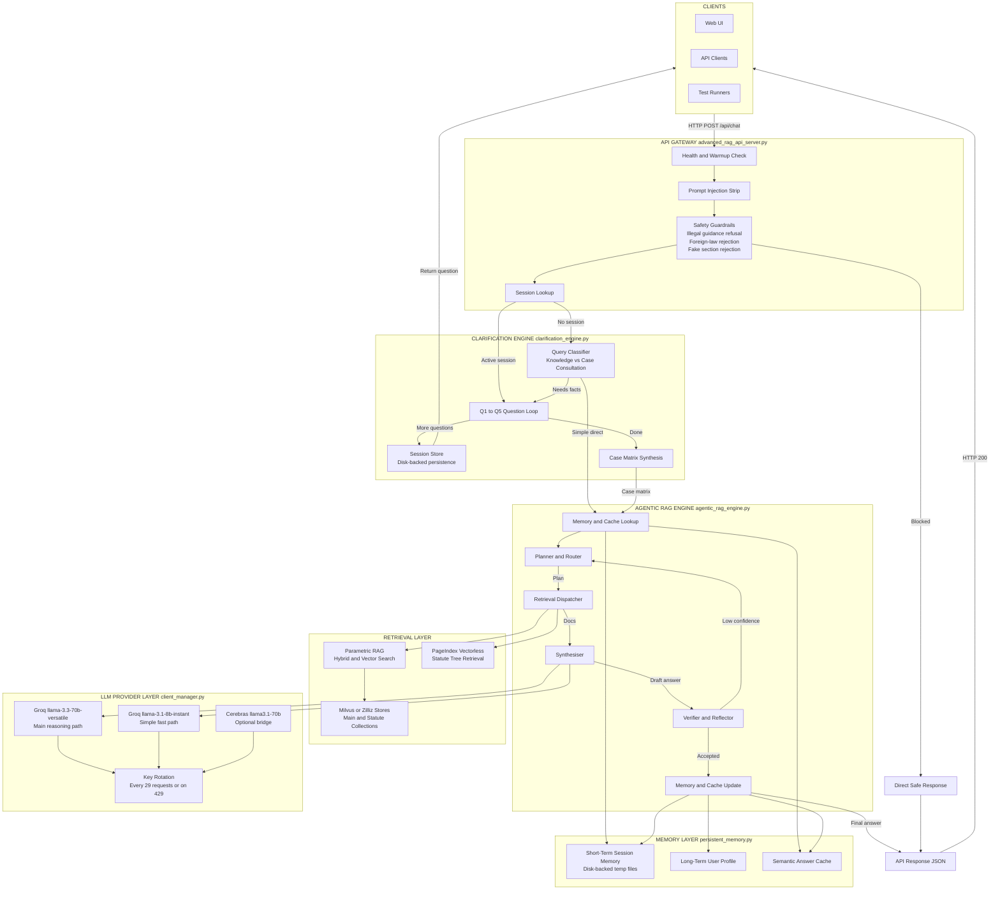

### Block Diagram 2 — End-To-End Runtime Request Trace

Step-by-step trace of a single request from entry to final response.

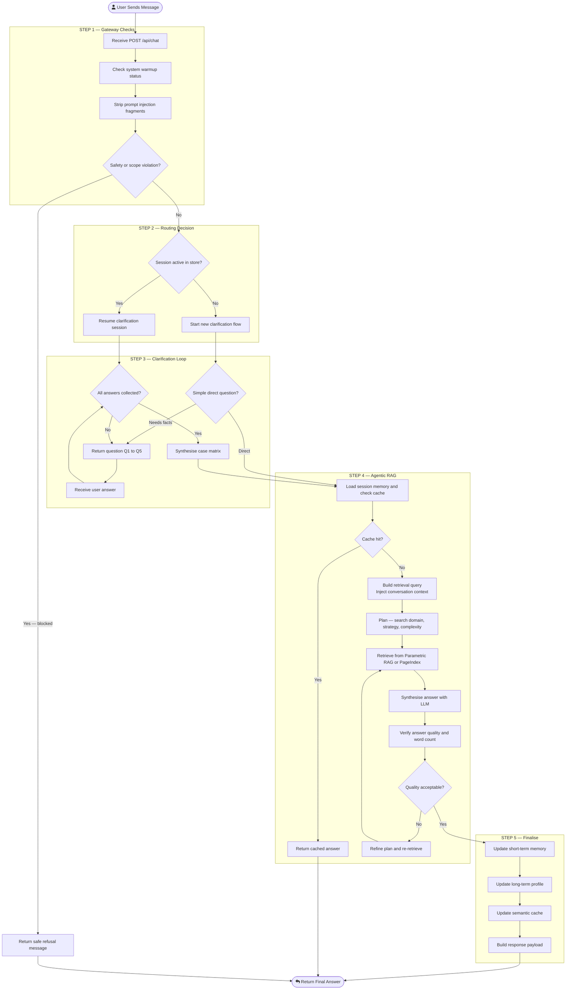

### Block Diagram 3 — Component Dependency Map

Shows which module calls which at runtime.

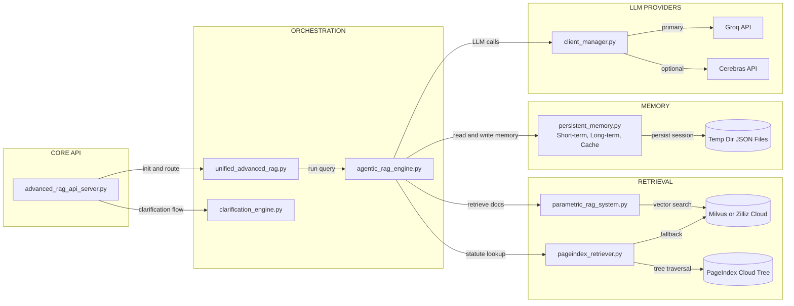

### Detailed Logic

1. Request enters FastAPI.
2. API checks whether the system is still warming up.
3. API strips obvious prompt-injection fragments.
4. API applies direct guardrails:
   - illegal guidance refusal
   - foreign-law out-of-scope rejection
   - fake section detection
5. If the session is already in the clarification loop, the answer is fed into the clarification engine.
6. If no clarification session exists, the clarification engine decides whether the query is:
   - greeting
   - irrelevant or out of domain
   - simple direct knowledge question
   - complex personal consultation requiring five questions
7. For simple direct questions, the agentic engine uses lightweight single-pass retrieval and generation.
8. For complex questions, the clarification engine gathers missing case facts.
9. Once clarification is complete, the final synthesized case matrix is sent into the standard RAG path.
10. The agentic engine retrieves evidence, synthesizes the answer, verifies adequacy, and may refine the plan.
11. The answer is returned, while session memory and semantic cache are updated.

## 5. Retrieval Architecture

### Important Distinction

Parametric RAG is not the vectorless retriever.

- Parametric RAG is parameter-driven retrieval optimization over hybrid and advanced search.
- PageIndex is the vectorless statute retriever.

### Block Diagram 4 — Parametric RAG Retrieval Pipeline

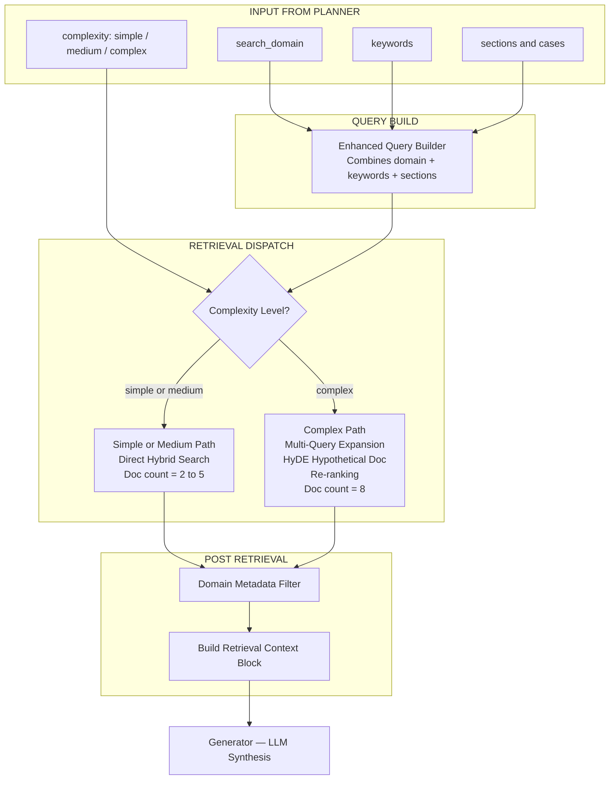

What parametric retrieval uses:

- vector and hybrid search
- metadata hints
- query enhancement
- reranking
- complexity-based document count

What it does not mean:

- it does not mean the retriever is purely model-memory-based
- it does not mean vectorless retrieval

### Block Diagram 5 — Vectorless PageIndex Statute Retrieval

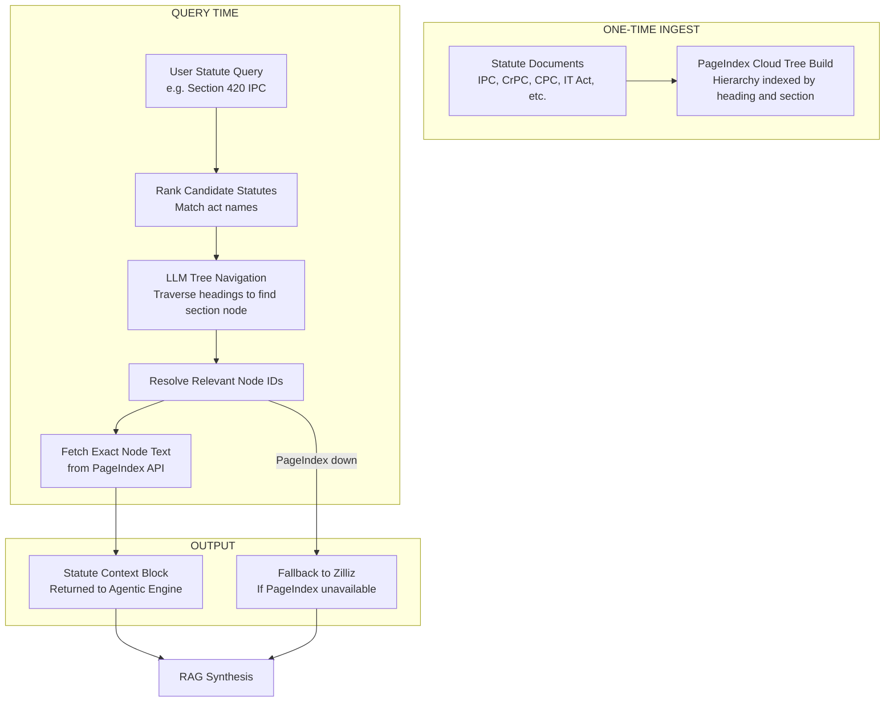

This layer is best for:

- exact section lookups
- act and article navigation
- statute text retrieval
- structured legal documents with headings and hierarchy

### Block Diagram 6 — Retrieval Strategy Comparison

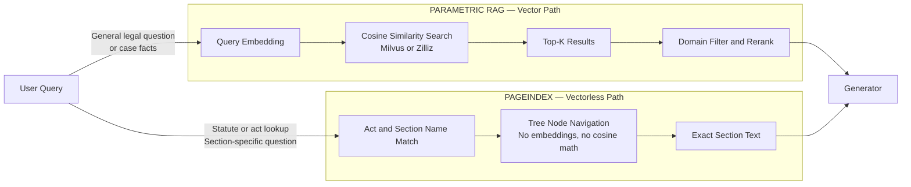

## 6. Clarification And Conversation Design

The clarification loop exists because case-consultation queries are usually underspecified.

Examples that should go direct:

- What is FIR?
- What is anticipatory bail?
- Explain Article 21.

Examples that should trigger clarification:

- I was fired without notice, what can I do?
- My landlord did not return my deposit.
- I was cheated by an online seller.

The clarification engine:

- distinguishes knowledge questions from personal-case questions
- supports Hindi and Romanized Hindi detection for direct informational questions
- stores question-answer history
- asks up to five questions
- synthesizes a structured factual matrix before final legal reasoning

The API persists clarification sessions to disk so session continuity survives request-to-request transitions.

### Block Diagram 7 — Clarification Session State Machine

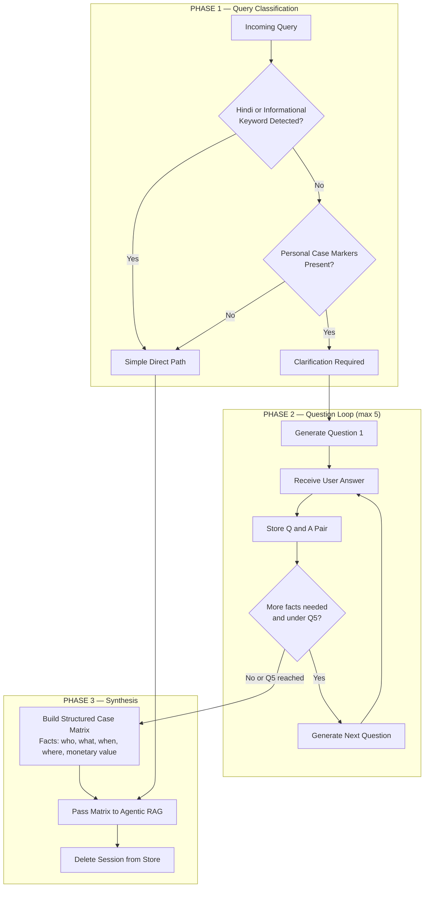

## 7. Memory, Session Continuity, And Cache

Current memory model has three main parts:

1. Short-term session memory
2. Long-term user profile memory
3. Semantic cache

### Short-Term Memory

Used for:

- follow-up questions such as under it, that offence, before arrest, what is the penalty under it
- conversation continuity
- clarification loop continuity

Current implementation detail:

- short-term memory is persisted to the temp directory for session reuse across requests
- this was added to reduce context loss on follow-up turns

### Long-Term Memory

Used for:

- user profile
- legal domain interests
- interaction count
- preference-style personalization

### Semantic Cache

Used for:

- repeated or similar queries
- reducing repeated expensive LLM generation
- returning fast cached answers when safe to do so

The system also avoids returning obviously stale cached stubs by checking for error-like phrases and very short low-value answers.

### Block Diagram 8 — Memory Architecture

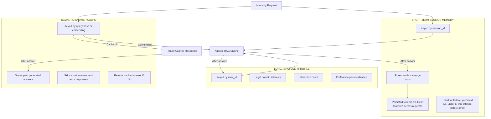

## 8. LLMs And Provider Strategy

### Main Model Roles

The current code uses multiple model roles:

- Main high-capability reasoning path: Groq-hosted llama-3.3-70b-versatile
- Fast simple direct path: llama-3.1-8b-instant
- Optional provider bridge: Cerebras llama3.1-70b mapping

### Provider Strategy

Provider manager supports:

- multiple Groq keys
- optional Cerebras key
- provider-aware model mapping
- forced rotation on 429

The GitHub workflow is designed for up to:

- 5 Groq keys
- 1 Cerebras key

The local app settings snapshot currently shows only:

- 1 Groq key
- 1 Cerebras key

That means supported architecture and currently observed environment are not necessarily identical. The code supports more keys than the local app-settings export currently proves.

### Block Diagram 9 — LLM Provider Strategy

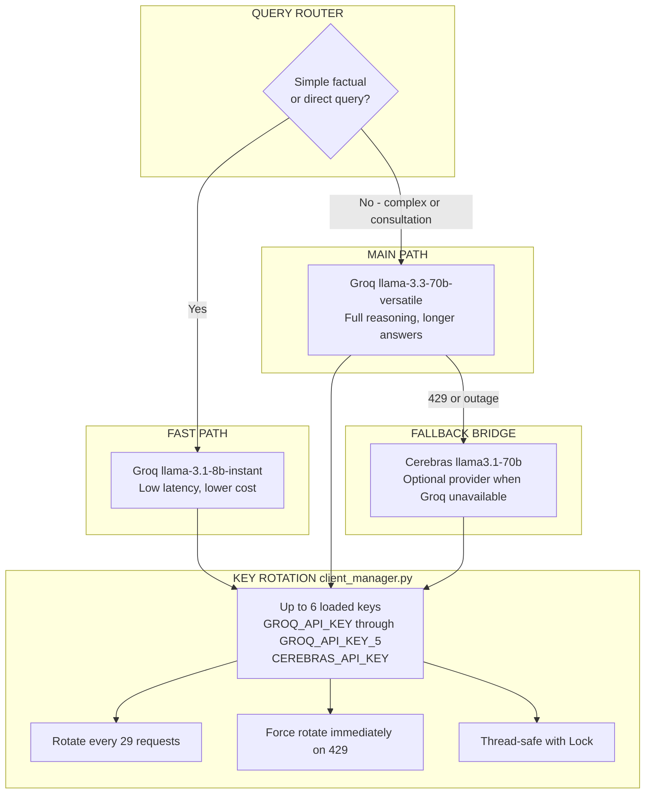

## 9. Resilience And Error Handling

### Built-In Guardrails

Current direct-response guardrails include:

- illegal-guidance refusal
- foreign-law out-of-scope refusal
- fake section reference rejection
- greeting detection

### Warmup Handling

If the RAG system is still loading, the API returns 503 with a warming-up message instead of crashing.

### Rate-Limit Handling

For 429 or provider rate-limit errors, the system uses:

- key rotation
- clarification retry logic
- fallback to direct RAG in some cases
- final 429 only if both primary and fallback paths fail

### Clarification Session Safety

The system now:

- persists clarification state to disk
- reloads persisted state rather than trusting only in-memory worker state
- deletes the session before final synthesis to avoid retry collisions

### Retrieval Graceful Degradation

If PageIndex is unavailable:

- statute retrieval falls back to Zilliz or hybrid retrieval

If advanced retrieval fails:

- parametric retrieval returns an empty or reduced result rather than crashing the full request path

## 10. Deployment Architecture

### Current Hosted Platform

The live backend is deployed on Azure App Service.

Relevant files:

- [startup.sh](startup.sh)
- [deploy.ps1](deploy.ps1)
- [.github/workflows/azure-deploy.yml](.github/workflows/azure-deploy.yml)

### Startup Runtime Shape

Current startup script behavior:

- Oryx extracts the app into a temp runtime directory
- startup script hot-patches selected Python files into the extracted runtime
- startup script clears stale bytecode
- app runs with Gunicorn plus UvicornWorker
- worker count is forced to 1

Why one worker is used:

- to avoid clarification-session inconsistency across multiple workers
- to stay inside low-memory Azure tier limits

Current runtime command:

- Gunicorn
- 1 worker
- Uvicorn worker class
- 600 second timeout

### Block Diagram 10 — Deployment Runtime Architecture

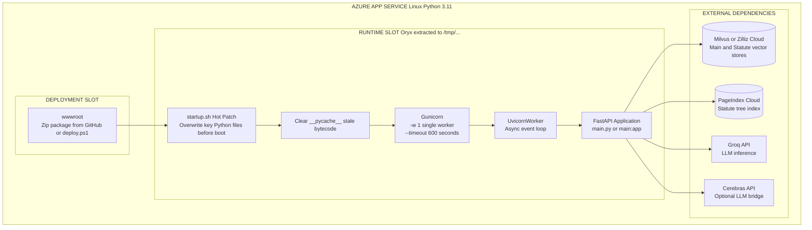

## 11. CI/CD

### GitHub Actions Pipeline

Workflow file:

- [.github/workflows/azure-deploy.yml](.github/workflows/azure-deploy.yml)

Main CI/CD steps:

1. checkout repository
2. set up Python 3.11
3. install dependencies for validation
4. build config/.env from GitHub secrets
5. zip the deployment package while excluding heavy local artifacts
6. log into Azure using service principal credentials
7. set Azure App Settings from secrets
8. deploy zip to Azure Web App
9. run health verification

### Block Diagram 11 — CI/CD Pipeline (GitHub Actions)

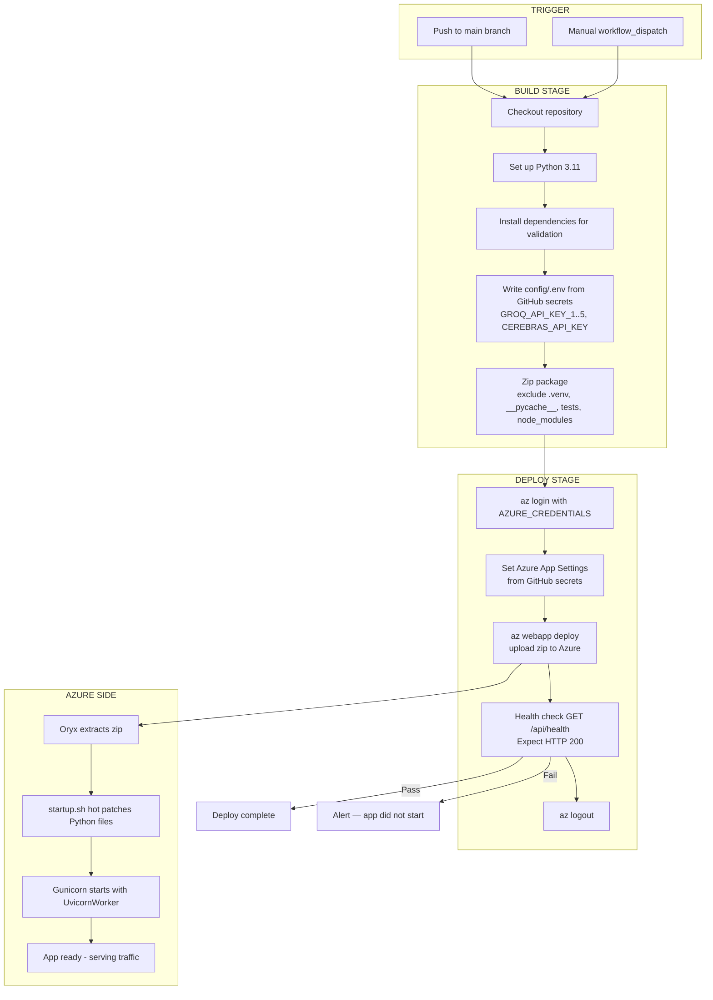

### Manual Deploy Path

There is also a manual Kudu-based deploy tool:

- [deploy.ps1](deploy.ps1)

It uploads selected files directly to Azure and restarts the app. This has been useful for hot fixes without rebuilding the full package.

### Block Diagram 12 — Manual Hot-Patch Deploy (deploy.ps1)

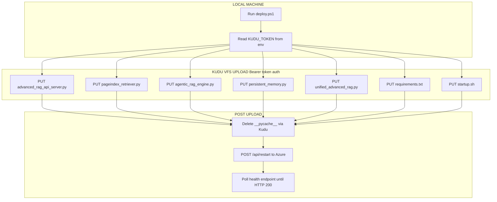

## 12. Capacity And Throughput Analysis

### Important Limitation

The current production deployment is intentionally conservative.

Key runtime facts:

- single Gunicorn worker
- one Azure App Service instance
- long-running external LLM calls
- multiple retrieval and verification steps for harder queries
- clarification flows that can span several requests

So the current system is best described as a small-beta or controlled-load deployment, not a high-scale public deployment.

### Throughput From Measured Benchmarks

Observed averages from recent live benchmarks:

- mixed chatbot benchmark average latency: about 3.3 seconds per request
- context-retention benchmark average latency: about 3.2 seconds per request
- ground-truth legal QA benchmark average latency: about 11.0 seconds per request
- full clarification-loop benchmark average per turn: much higher, with final synthesis around 17 to 20 seconds

### Practical Request Capacity

Rough serial request throughput, if the system handled one request at a time:

- at 3.3 seconds average: about 18 requests per minute
- at 11 seconds average: about 5 requests per minute

Because Uvicorn can overlap some network waiting, real throughput can be somewhat better than pure serial math, but the single-worker design still makes the deployment strongly constrained.

### Practical User Capacity Estimate

For the current single-worker Azure setup, realistic rough guidance is:

- simple FAQ style traffic: around 10 to 18 requests per minute total
- mixed real traffic: around 5 to 12 requests per minute total
- clarification-heavy legal consultations: around 2 to 6 requests per minute total

In active-user terms, the current live deployment is most safely treated as:

- around 5 to 15 light active users if they ask occasional direct questions
- around 2 to 5 active users if they are doing long multi-turn case consultations at the same time

This is an estimate, not a guaranteed SLA.

### LLM-Key Rotation Capacity

The provider manager rotates after 29 requests per key.

If fully configured as the CI workflow intends, the code can use up to 6 loaded keys.

That gives a theoretical rotation envelope of:

- 29 times 6 = 174 provider calls before cycling through the full loaded-key pool

But this is not the same as 174 user requests, because:

- one user request may trigger multiple LLM calls
- clarification turns call the model again
- plan and verify loops can create extra calls
- the app server itself is still the stronger bottleneck today

### Bottom Line On Capacity

The current hard bottleneck is more the application runtime shape than the model-key pool.

The biggest concurrency constraints are:

- single Gunicorn worker
- long upstream model latency
- Azure App Service cold starts and low-tier performance
- complex consultations using multiple LLM and retrieval steps

## 13. Error And Resilience Flow

### Block Diagram 13 — Error Handling Decision Tree

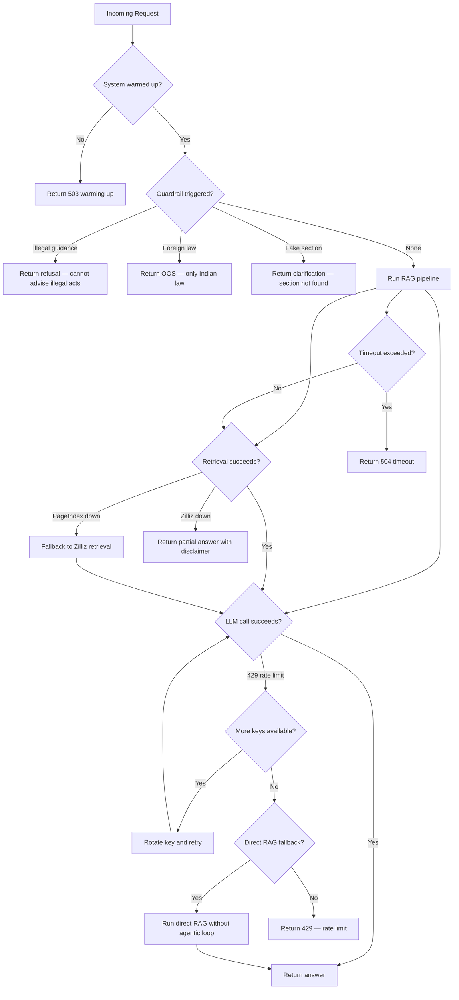

## 14. Conditions Under Which Request Errors Can Still Happen

### Low-Risk, Already Mitigated

- upstream 429 from Groq during clarification
- stale in-memory clarification state
- fake legal section hallucination prompts
- illegal guidance prompts
- foreign-law requests

### Still Possible

1. Cold start or warmup 503
2. Azure restart during active traffic
3. upstream provider outage beyond retry or fallback logic
4. low-memory or long-tail timeout behavior under sustained traffic
5. missing environment variables after deployment
6. PageIndex disabled or not indexed
7. retrieval-store connectivity failures
8. long-request backlog due to single-worker deployment

### Most Likely Real-World Failure Modes On Current Setup

- burst traffic causes queueing and user-perceived slowness
- cold starts return temporary 503 during initialization
- clarification-heavy traffic raises tail latency sharply
- upstream model limits increase fallback frequency

## 15. What To Change If You Need Higher User Volume

If the goal is to support materially more users per minute, the best next steps are:

1. Move off the current low-tier single-worker shape to at least a Basic or Standard Azure plan.
2. Separate clarification-session state into Redis or a proper shared store.
3. Increase worker count after session state is externalized.
4. Keep simple direct path aggressive for factual questions.
5. Add queueing or backpressure for long consultation requests.
6. Add request metrics and P95 latency monitoring.
7. Make sure all intended Groq keys are actually present in the live environment.
8. Keep PageIndex for exact statute traffic so statute lookup load stays efficient.

## 16. Final Assessment

Current system strengths:

- strong routing quality
- full clarification loop working live
- memory continuity mostly strong
- direct-answer speed much better for simple questions
- good guardrails for safety and invalid legal references
- graceful degradation paths exist for several failure modes

Current system limits:

- deployment is not horizontally scalable yet
- single-worker runtime is the main throughput bottleneck
- long complex legal consultations still carry high latency
- broader context retention is strong but not yet perfect

Best single-sentence summary:

LAW-GPT is a hybrid agentic legal AI platform for Indian law that combines routed LLM reasoning, vector and hybrid retrieval, vectorless statute tree search, session memory, and a five-question consultation flow, but its current Azure deployment is optimized for correctness and controlled traffic rather than high-scale concurrency.